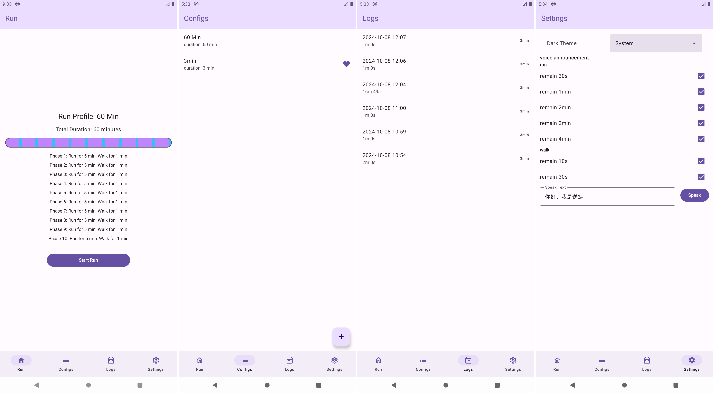

# Fartlek

基于 Jetpack Compose 的 法特莱克 跑步计时器

## 安装

[release](https://github.com/Ling-yunchi/Fartlek/releases)

## 功能

- 手动定义跑步计划，配置每段慢跑与快走的时间
- 跑步语音播报调用系统TTS，如果没有安装则不会发出声音
- 每次跑步保存记录
- 黑暗模式

## 预览

